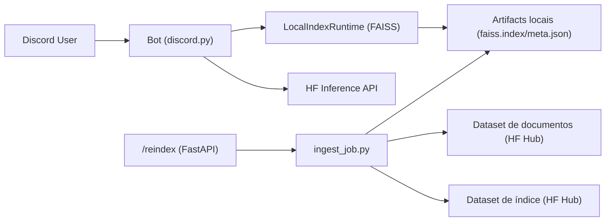

# BotSpace

Bot para Discord com RAG (Retrieval-Augmented Generation) usando documentos jurídicos, indexação local com FAISS e geração de respostas via Hugging Face Inference API.

## Visão Geral

O projeto combina três partes principais:

- Bot Discord (`!rag`, `!reindex` e resposta por menção)
- API FastAPI para saúde, logs e reindexação protegida por token
- Pipeline de ingestão que baixa documentos, sanitiza arquivos, cria embeddings e publica artefatos de índice

## Funcionalidades

- Busca semântica local com `sentence-transformers` + `faiss-cpu`
- Reindex manual por comando no Discord ou endpoint HTTP
- Recarregamento automático do índice em runtime
- Sanitização de documentos (`.doc` -> `.docx`, remoção de formatos não suportados)
- Execução em Docker (compatível com Hugging Face Spaces)

## Arquitetura



## Pré-requisitos

- Python 3.12+
- `uv` instalado
- Ambiente virtual (`.venv`) configurado
- Token de bot do Discord
- Token do Hugging Face com permissões para leitura/escrita nos repositórios usados

## Quick Start (Local)

1. Criar/ativar ambiente virtual e instalar dependências com `uv`:

```bash
uv venv
source .venv/bin/activate
uv pip install -r requirements.txt
```

2. Criar `.env` (ou exportar variáveis):

```bash
export DISCORD_TOKEN="..."
export REINDEX_API_TOKEN="..."
export HF_TOKEN="..."
export DOCS_REPO_ID="usuario/dataset-documentos"
export INDEX_REPO_ID="usuario/dataset-indice"
export DOCS_SUBDIR="docs_rag"
```

3. Executar:

```bash
python main.py
```

## Configuração

| Variável | Obrigatória | Default | Descrição |
|---|---|---|---|
| `DISCORD_TOKEN` | Sim | - | Token do bot Discord |
| `BOT_PREFIX` | Não | `!` | Prefixo de comandos |
| `REINDEX_API_TOKEN` | Sim | - | Token Bearer para `POST /reindex` |
| `HF_TOKEN` | Sim | - | Token para Hugging Face Hub/Inference |
| `HF_TEXT_MODEL` | Não | `microsoft/Phi-3.5-mini-instruct` | Modelo de geração de texto |
| `HF_INFERENCE_URL` | Não | construído a partir de `HF_TEXT_MODEL` | URL da Inference API |
| `DOCS_REPO_ID` | Sim (ingestão) | - | Dataset fonte de documentos |
| `INDEX_REPO_ID` | Sim (ingestão) | - | Dataset destino dos artefatos de índice |
| `DOCS_SUBDIR` | Não | `docs_rag` | Subdiretório dos documentos no dataset |
| `EMBED_MODEL` | Não | `sentence-transformers/all-MiniLM-L6-v2` | Modelo de embeddings |
| `CHUNK_CHARS` | Não | `1200` | Tamanho de chunk |
| `CHUNK_OVERLAP` | Não | `200` | Sobreposição de chunks |
| `WORK_DIR` | Não | `/data/work` (app) / `/tmp/rag_job` (ingest) | Diretório de trabalho |
| `ARTIFACTS_PREFIX` | Não | `artifacts` | Prefixo de arquivos no dataset de índice |
| `RELOAD_POLL_SECONDS` | Não | `30` | Intervalo para detectar atualização do índice |
| `REINDEX_EVERY_SECONDS` | Não | `0` | Agendamento automático de reindex (0 desativa) |

## Uso

### Comandos do Bot

- `!rag <pergunta>`: responde com base nos trechos mais relevantes do índice
- `!reindex` (admin): dispara reindexação
- Menção ao bot: responde à pergunta presente na menção

### Endpoints HTTP

- `GET /health` -> `ok`
- `GET /logs` -> últimos logs da ingestão
- `POST /reindex` -> dispara ingestão
  - Header obrigatório: `Authorization: Bearer <REINDEX_API_TOKEN>`

## Docker

Build e run local:

```bash
docker build -t botspace .
docker run --rm -p 7860:7860 \
  -e DISCORD_TOKEN="$DISCORD_TOKEN" \
  -e REINDEX_API_TOKEN="$REINDEX_API_TOKEN" \
  -e HF_TOKEN="$HF_TOKEN" \
  -e DOCS_REPO_ID="$DOCS_REPO_ID" \
  -e INDEX_REPO_ID="$INDEX_REPO_ID" \
  botspace
```

## Estrutura do Projeto

```text
.
├── main.py                 # API FastAPI + scheduler + bootstrap do bot
├── bot_app.py              # Bot Discord e comandos
├── ingest_job.py           # Pipeline de ingestão e publicação do índice
├── index_local_runtime.py  # Carregamento/consulta local do índice
├── hf_client.py            # Cliente de inferência no HF
├── sanitize_docs.py        # Conversão/sanitização de documentos
├── prompts.py              # Prompt base para respostas
├── Dockerfile
└── docs_rag/               # Base documental local (quando aplicável)
```

## Troubleshooting

- Erro `HF_TOKEN nao definido`: exporte `HF_TOKEN` antes de iniciar.
- Erro `DISCORD_TOKEN nao definido`: verifique token do bot e permissões no servidor.
- `Indice nao existe ... Rode reindex primeiro.`: execute `!reindex` ou `POST /reindex`.
- Falha com `.doc`: garanta LibreOffice/`soffice` disponível (já incluso no Dockerfile).

## Contribuição

1. Crie uma branch para sua alteração.
2. Faça mudanças pequenas e testáveis.
3. Abra PR com contexto, impacto e forma de validação.

## Licença

Defina a licença do projeto (ex.: MIT) e adicione o arquivo `LICENSE` no repositório.
